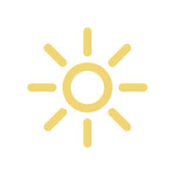

`Python: "sky"`

Maverick provides a physically-based sky/sun/atmosphere system, coupled with an astronomical and geographical positioning system. Using the sky/sun node is a more straightforward alternative to Image-Based Lighting for exterior scenes.

{style="max-width: 80px;"}

## Sky

#### Sun/sky
`Python: "sky_enable"`

Enables the physical sun and sky illumination. The illumination is entirely parametric: The sun and sky colors will vary depending on the selected position, date and time.

#### Trace set ID
`Python: "sky_trace_set_id"`

Trace set the sky belongs to. For example, you can use this in combination with an object's exclude list to make the sky not affect that particular object.

#### Sky multiplier
`Python: "sky_multiplier"`

The sky multiplier allows to lower or increase the sky illumination intensity compared to the physically-correct default.

#### Enable sky multiplier
`Python: "sky_multiplier_enable"`

Enables the sky Multiplier parameter.

#### Sky model
`Python: "sky_model"`

Allows you to selected between different iterations of physical sky models. The available models are: - Hosek and Wilkie: A modern, accurate model with vibrant and realistic colors. - Preetham and al.: An older model with less accurate colors but slightly more creative freedom. - CIE standard overcast: A constant color sky with no atmosphere scattering representation.

## Sun

#### Enable sun
`Python: "sun_enable"`

Enables the sun illumination.

#### Trace set ID
`Python: "sun_trace_set_id"`

Trace set the sun belongs to. For example, you can use this in combination with an object's exclude list to make the sun not affect that particular object.

#### Sun multiplier
`Python: "sun_multiplier"`

The sun multiplier allows to decrease or increase the sun illumination intensity compared to the physically-correct default.

#### Enable sun multiplier
`Python: "sun_multiplier_enable"`

Enables the sun Multiplier parameter.

#### Kelvin temperature
`Python: "sun_kelvin"`

Set a custom sun color using Kelvin temperature scale. The default value of 5777 is suitable for a realistic zenith sun with clear sky.

#### Enable Kelvin temperature
`Python: "sun_kelvin_enable"`

Enables the Kelvin temperature color setting.

#### Sun diameter
`Python: "sun_diameter"`

Controls the sun's solid angle as seen from Eart. The physically correct value is 0.51-0.53. Anything lower will result in a much smaller sun, harder shadows and potentially more specular noise.

#### Enable sun diameter
`Python: "sun_diameter_enable"`

Enables the Custom sun Diameter setting.

## Orientation

#### Azimuth
`Python: "sun_azimuth"`

Controls the sun's Azimuth (rotation along the horizon).

#### Altitude
`Python: "sun_altitude"`

Control the sun's Altitude (elevation above the horizon).

#### Astronomical
`Python: "sun_astronomical_enable"`

Enables physical astronomical sun positioning using real latitude, longitude and other physically-correct parameters.

#### Latitude
`Python: "sky_latitude"`

Define the scene's origin position on earth along the latitude (North-South) axis.

#### Longitude
`Python: "sky_longitude"`

Defines the scene's origin position on earth along the longitude (East-West) axis.

#### Heading
`Python: "sky_heading"`

Allows to arbitrarily change the North direction to accommodate for a scene that is not aligned properly.

#### Year
`Python: "sun_year"`

Defines the Year at which the physical atmosphere should be simulated.

#### Month
`Python: "sun_month"`

Defines the Month of the Year at which the physical atmosphere should be simulated.

#### Day
`Python: "sun_day"`

Defines the Day of the Month at which the physical atmosphere should be simulated.

#### GMT
`Python: "sun_gmt"`

Shifts the timezone.

#### Hour
`Python: "sun_hour"`

Defines the Hour of the Day at which the physical atmosphere should be simulated.

#### Minute
`Python: "sun_minute"`

Defines the Minute of the Hour at which the physical atmosphere should be simulated.

## Environment

#### Turbidity
`Python: "sky_turbidity"`

Controls the amount of small particles present in the atmosphere (usually smoke or vapor) that give a hazy look. Increasing this value lead to dimmer shadows and redder sky.

#### Aerosol
`Python: "sky_aerosol"`

Varies the amount of gases present in the atmosphere which induces a shift of colors. This parameter is not compatible with the Hosek and Wilkie model.

#### Ground mode
`Python: "ground_mode"`

Selects how the physical atmosphere should render below the horizon line: - Clamped Horizon: The last row of pixels before the horizon is repeated all the way down - Symmetric Horizon: The physical atmosphere is symmetrically repeated below the horizon - Ground Color: Define a custom color below the horizon

#### Ground color
`Python: "ground_color"`

Defines the custom ground color. This can be useful to mimic the Earth's average color where the scene takes place to increase realism slightly.

