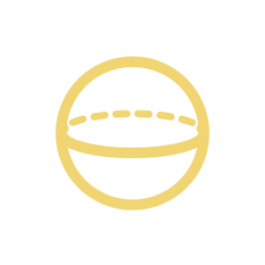

`Python: "ibl"`

IBL stands for Image-Based Lighting. The ibl node defines the environment dome that surrounds the scene. Often times, IBL is configured by providing an HDR map such as a landscape in panoramic (latitude-longitude) format.
## Image-Based Lighting

#### Enable IBL
`Python: "ibl_enable"`

Enables the IBL (environment). The IBL acts as a light source placed at the skydome.{style="max-width: 32px;"}

#### Projection
`Python: "ibl_projection"`

Changes how the IBL texture is projected onto the skydome. Most .hdr and .exr IBL maps are suitable for spherical (latitude-longitude) projection.{style="max-width: 32px;"}

#### Trace set ID
`Python: "ibl_trace_set_id"`

Trace set the IBL belongs to. For example, you can use this in combination with an object's exclude list to make the IBL not affect that particular object.{style="max-width: 32px;"}

#### Resample supersampling
`Python: "ibl_resample_ss"`

INTERNAL: Maximum supersampling level used when the IBL map is resampled to compute its importance sampling table. Interpreted as [px,px].{style="max-width: 32px;"}

#### Samples
`Python: "ibl_samples"`

Controls the amount of samples used for the IBL. More samples will reduce IBL noise at the expense of some performance. This should only be used if the IBL-induced noise is visibly worse than the noise induced by other light sources.{style="max-width: 32px;"}

#### IBL defocus
`Python: "ibl_defocus"`

Simulates Depth Of Field by blurring the IBL in the same way that camera Depth Of Field would.{style="max-width: 32px;"}

#### Angle
`Python: "ibl_angle"`

Controls the orientation of the IBL.{style="max-width: 32px;"}

#### Link to view
`Python: "ibl_link_to_view"`

Links the IBL rotation to the camera orientation, so it will appear to be static as the camera moves around.{style="max-width: 32px;"}

#### Intensity
`Python: "ibl_intensity"`

IBL light intensity (or power). This value is given in kilo-candelas per square meter (kcd/m2). A value of 10 therefore corresponds to 10,000 candelas per square meter, which is roughly the brightness of an overcast sky.{style="max-width: 32px;"}

#### Desaturation
`Python: "ibl_desaturation"`

Modulates the saturation of the IBL color/map. This avoids the use of a color correction map node in those cases where the original hues of the IBL need some neutralization.{style="max-width: 32px;"}

#### Color
`Python: "ibl_color"`

Custom solid color for the environment illumination.{style="max-width: 32px;"}

#### Color texture map
`Python: "ibl_color_map"`

Custom texture map for the environment illumination. High Dynamic Range (32-bit) images should be used if possible.{style="max-width: 32px;"}

#### Input colorspace
`Python: "ibl_color_inv_gamma"`

Interprets the input emission color/image as regular sRGB (gamma=2.2), as linear (no gamma), or as raw (gamma=1/2.2). e.g., most images are in sRGB, but .hdr/.exr images generally expect to be interpreted as linear. When in doubt, cycle through the options, as one will clearly look good and the other two will look washed out or burned out in direct vision.{style="max-width: 32px;"}

## Parametric lightbox

#### Enable lightbox
`Python: "ibl_lightbox_enable"`

Enables the parametric lightbox overlay. The IBL lightbox is a geometry-less parametric room meant to be overlaid on the IBL for extremely efficient renders. The IBL lightbox is typically used in conjunction with a shadow catcher floor.{style="max-width: 32px;"}

#### Lightbox intensity
`Python: "ibl_lightbox_intensity"`

Intensity of the parametric lightbox, in the same units as the IBL.{style="max-width: 32px;"}

#### Parametric lightbox map
`Python: "ibl_lightbox_map"`

The parametric lightbox is configured through the lightbox map plugged to this slot.{style="max-width: 32px;"}

#### Lightbox angle
`Python: "ibl_lightbox_angle"`

Controls the orientation of the parametric lightbox.{style="max-width: 32px;"}

## Reflection override

#### Reflection override
`Python: "ibl_refl_enable"`

Enables the IBL reflection override. This will act as a replacement for the regular IBL but only for reflective bounces. You can use this to preserve IBL illumination while making reflective materials such as metals reflect a different IBL image.{style="max-width: 32px;"}

#### Override per material
`Python: "ibl_refl_per_mtl_enable"`

When this option is set materials will reflect (or ignore) the IBL override depending on their trace sets flags.{style="max-width: 32px;"}

#### Projection
`Python: "ibl_refl_projection"`

Changes how the IBL reflection override is projected onto the skydome.{style="max-width: 32px;"}

#### Angle
`Python: "ibl_refl_angle"`

Controls the orientation of the IBL reflection override.{style="max-width: 32px;"}

#### Intensity
`Python: "ibl_refl_intensity"`

Intensity of the IBL reflection override, in the same units as the IBL.{style="max-width: 32px;"}

#### Desaturation
`Python: "ibl_refl_desaturation"`

Modulates the saturation of the IBL reflection override.{style="max-width: 32px;"}

#### Reflection color
`Python: "ibl_refl_color"`

Custom solid color for the IBL reflection override.{style="max-width: 32px;"}

#### Color texture map
`Python: "ibl_refl_color_map"`

Custom texture map for the IBL reflection override.{style="max-width: 32px;"}

#### Input colorspace
`Python: "ibl_refl_color_inv_gamma"`

Interprets the input emission color/image as regular sRGB (gamma=2.2), as linear (no gamma), or as raw (gamma=1/2.2). e.g., most images are in sRGB, but .hdr/.exr images generally expect to be interpreted as linear. When in doubt, cycle through the options, as one will clearly look good and the other two will look washed out or burned out in direct vision.{style="max-width: 32px;"}

## Refraction override

#### Refraction override
`Python: "ibl_refr_enable"`

Enables the IBL refraction override. This will act as a replacement for the regular IBL but only for refractive bounces. You can use this to preserve IBL illumination while making refractive materials such as glass refract a different IBL image.{style="max-width: 32px;"}

#### Override per material
`Python: "ibl_refr_per_mtl_enable"`

When this option is set materials will refract (or ignore) the IBL override depending on their trace sets flags.{style="max-width: 32px;"}

#### Projection
`Python: "ibl_refr_projection"`

Changes how the IBL refraction override is projected onto the skydome.{style="max-width: 32px;"}

#### Angle
`Python: "ibl_refr_angle"`

Controls the orientation of the IBL refraction override.{style="max-width: 32px;"}

#### Intensity
`Python: "ibl_refr_intensity"`

Intensity of the IBL refraction override, in the same units as the IBL.{style="max-width: 32px;"}

#### Desaturation
`Python: "ibl_refr_desaturation"`

Modulates the saturation of the IBL reflection override.{style="max-width: 32px;"}

#### Refraction color
`Python: "ibl_refr_color"`

Custom solid color for the IBL refraction override.{style="max-width: 32px;"}

#### Color texture map
`Python: "ibl_refr_color_map"`

Custom texture map for the IBL refraction override.{style="max-width: 32px;"}

#### Input colorspace
`Python: "ibl_refr_color_inv_gamma"`

Interprets the input emission color/image as regular sRGB (gamma=2.2), as linear (no gamma), or as raw (gamma=1/2.2). e.g., most images are in sRGB, but .hdr/.exr images generally expect to be interpreted as linear. When in doubt, cycle through the options, as one will clearly look good and the other two will look washed out or burned out in direct vision.{style="max-width: 32px;"}

## Dome

#### Enable dome radius
`Python: "ibl_dome_radius_enable"`

By default the IBL color map is projected at infinity (i.e., in a sphere with infinite radius). This feature turns the IBL into a sphere with a definite center and a finite radius.{style="max-width: 32px;"}

#### Dome radius
`Python: "ibl_dome_radius"`

Defines a finite radius for the IBL dome.{style="max-width: 32px;"}

#### Dome center X
`Python: "ibl_dome_center_x"`

Places the X coordinate of the IBL dome's center.{style="max-width: 32px;"}

#### Dome center Y
`Python: "ibl_dome_center_y"`

Places the Y coordinate of the IBL dome's center.{style="max-width: 32px;"}

#### Dome center Z
`Python: "ibl_dome_center_z"`

Places the Z coordinate of the IBL dome's center.{style="max-width: 32px;"}

#### Enable dome floor
`Python: "ibl_dome_floor_enable"`

Cuts the IBL sphere by a plane centered at the dome's center. The bottom of the IBL map is reprojected on the dome's floor, grounding objects and allowing to control DOF.{style="max-width: 32px;"}

#### Dome floor Z offset
`Python: "ibl_dome_floor_z"`

Offsets the dome floor above (+) or below (-) the dome's center.{style="max-width: 32px;"}

## Backplate (direct vision)

#### Enable backplate
`Python: "backplate_enable"`

Enables the backplate. Note that unlike the IBL itself, the backplate does not contribute to the illumination of the scene. The backplate is only visible in the background of the rendered image.{style="max-width: 32px;"}

#### Projection
`Python: "backplate_projection"`

Changes how the backplate texture is projected onto the skydome. Most .hdr and .exr IBL maps are suitable for spherical (latitude-longitude) projection. Most .jpg or .png photographs are meant to be camera/screen-mapped.{style="max-width: 32px;"}

#### Aspect
`Python: "backplate_aspect"`

Stretches the backplate horizontally or vertically while keeping its short edge docked to the render frame. For a filetex map, the value that keeps pixels in a 1:1 ratio is width/height.{style="max-width: 32px;"}

#### Angle
`Python: "backplate_angle"`

Controls the orientation of the backplate.{style="max-width: 32px;"}

#### Link angle
`Python: "backplate_link_angle"`

Keeps the backplate rotation anchored to the IBL orientation.{style="max-width: 32px;"}

#### Intensity
`Python: "backplate_intensity"`

Backplate intensity, in the same units as the IBL intensity. The backplate intensity is independent from the IBL to allow for background-only exposure adjustments when needed.{style="max-width: 32px;"}

#### Lock exposure
`Python: "backplate_lock_exposure"`

Locks the backplate exposure to its default value, ignoring the camera's settings.{style="max-width: 32px;"}

#### Color
`Python: "backplate_color"`

Custom solid color for the backplate.{style="max-width: 32px;"}

#### Texture
`Python: "backplate_color_map"`

Custom texture map for the backplate. A backplate texture may be a regular (non-HDR) photograph. HDR images are supported, regardless.{style="max-width: 32px;"}

#### Input colorspace
`Python: "backplate_color_inv_gamma"`

Interprets the input emission color/image as regular sRGB (gamma=2.2), as linear (no gamma), or as raw (gamma=1/2.2). e.g., most images are in sRGB, but .hdr/.exr images generally expect to be interpreted as linear. When in doubt, cycle through the options, as one will clearly look good and the other two will look washed out or burned out in direct vision.{style="max-width: 32px;"}

#### Send filetex resolution
`Python: "backplate_send_resolution"`

Sends the resolution of the connected filetex to the still frame tab in the batcher.{style="max-width: 32px;"}

