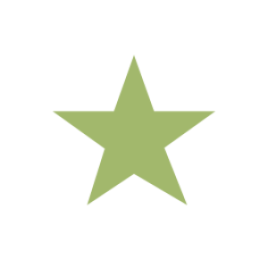

`Python: "tonemap"`

The tonemap node features an impressive multi-stage toolchain for image post-processing. Exposure compression (a.k.a., tonemapping) remaps original radiances into the LDR range necessary to visualize the image through a computer screen. The color-grading and lens simulation rollups provide advanced controls for retouching, lens diffraction (e.g., glare/bloom), and more.
## Tone compressor

#### Render color space
`Python: "tonemap_colorspace"`

Selects which color space the rendered image should be ready for. This affects saved images in 8/16-bit depth. This won't affect 32-bit (floating-point) images.{style="max-width: 32px;"}

#### Gamma
`Python: "tonemap_gamma"`

Changes the render gamma. The default value of 2.2 is correct for linear workflow in consistency with other imaging software.{style="max-width: 32px;"}

#### Exposure
`Python: "tonemap_exposure"`

Changes the render's' global exposure. The value is given in EV, where each increment or decrement of one unit doubles or halves the image brightness.{style="max-width: 32px;"}

#### Show clipping
`Python: "tonemap_show_clipping"`

Overlays the parts parts of the image that are brighter-than-white and darker-than-black in order to help the user find the right white/black/highlight/shadows/midtones adjustments to avoid clipping.{style="max-width: 32px;"}

#### Affect alpha only
`Python: "tonemap_alpha_blend_enable"`

Makes the color-grading stages of the tonemapping toolchain affect pixels with non-zero alpha only. This can be useful to keep the background unaffected by the tonemapping alterations.{style="max-width: 32px;"}

#### Burn
`Python: "tonemap_burn"`

Controls how quickly and how hard highlight tones burn to white.{style="max-width: 32px;"}

#### Color burn
`Python: "tonemap_color_burn"`

Color burn (internal).{style="max-width: 32px;"}

## Curves

#### Strength
`Python: "tonemap_curves_strength"`

Controls the impact of the curves parameters. The higher the strength the more the curves changes will affect the original render.{style="max-width: 32px;"}

#### Enable curves
`Python: "tonemap_curves_enable"`

Enables curves tone-mapping editing. Curves independently control the highlights/midtones/shadows as well as define the color luminance above which the image is clamped to white and below which it is clamped to black.{style="max-width: 32px;"}

#### Highlights
`Python: "tonemap_highlights"`

Controls how intense the highlight (bright) parts of the image burn and appear completely white. Lowering this value can reveal details in highlights at the expense of overall image contrast and photo-realism.{style="max-width: 32px;"}

#### Midtones
`Python: "tonemap_midtones"`

Controls how intense the midtones (average) parts of the image are. Midtones are the areas of the render that gradually blend from the darkest (shadows) to the brightest (highlights) areas. Increasing this value generally brighten the image without compromising contrast too much as highlights and shadows are untouched.{style="max-width: 32px;"}

#### Shadows
`Python: "tonemap_shadows"`

Controls how intense the shadow (dark) parts of the image are and gradually go to black in the darkest areas. Increasing this value can reveal details in the shadows at the expense of overall image contrast and photo-realism.{style="max-width: 32px;"}

#### Contrast
`Python: "tonemap_contrast"`

Controls the image contrast interactively.{style="max-width: 32px;"}

#### Whites
`Python: "tonemap_whites"`

Controls above which luminance level colors are clamped to white. Lowering this value prevents very bright areas of the image to display no details as they are clamped to white.{style="max-width: 32px;"}

#### Blacks
`Python: "tonemap_blacks"`

Controls below which luminance level colors are clamped to black. Increasing this value prevents very dark areas of the image to display no details as they are clamped to black.{style="max-width: 32px;"}

## Grading

#### Strength
`Python: "tonemap_grading_strength"`

Controls the importance of the Grading parameters. The higher the importance the more the grading changes blend with the original render.{style="max-width: 32px;"}

#### Enable color-grading
`Python: "tonemap_grading_enable"`

Enables color-grading, which modulates the colors of an image to achieve or reinforce a specific look.{style="max-width: 32px;"}

#### Vibrance
`Python: "tonemap_vibrance"`

Modulates the saturation of the already relatively muted colors while leaving the colors already quite saturated untouched.{style="max-width: 32px;"}

#### Saturation
`Python: "tonemap_saturation"`

Controls the image saturation interactively. Lowering this value down to 0 produces a black and white image.{style="max-width: 32px;"}

#### White balance temperature
`Python: "tonemap_temperature"`

Changes the color temperature used for the white balance. Setting a cold color will make the image tend to a colder temperature.{style="max-width: 32px;"}

#### White balance color
`Python: "tonemap_white_balance"`

The white balance color works the opposite way as the temperature slider and acts as a filter that subtract the selected color from the render.{style="max-width: 32px;"}

#### Enable white balance
`Python: "tonemap_white_balance_enable"`

Enables white balance correction.{style="max-width: 32px;"}

#### Tint
`Python: "tonemap_tint"`

Modulates the image tint toward more green or more magenta.{style="max-width: 32px;"}

#### White balance filter
`Python: "tonemap_filter"`

The white balance filter works similarly to placing a colored filter in front of a camera to tint the image in a particular way.{style="max-width: 32px;"}

#### Enable filter
`Python: "tonemap_filter_enable"`

Enables filter color.{style="max-width: 32px;"}

## LUT

#### LUT Strength
`Python: "tonemap_lut_strength"`

Defines the LUT strength by blending the original and corrected images by the specified amount.{style="max-width: 32px;"}

#### Enable LUT
`Python: "tonemap_lut_enable"`

Enables LUT (Look Up Table) color-grading.{style="max-width: 32px;"}

#### LUT preset
`Python: "tonemap_lut_preset"`

Defines which pre-defined LUT color profile to use.{style="max-width: 32px;"}

#### Enable preset selector
`Python: "tonemap_lut_map_enable"`

Enables the selector for pre-defined LUT color profiles.{style="max-width: 32px;"}

#### Master LUT map
`Python: "tonemap_lut_map"`

Overrides the master LUT color-grading by providing a custom LUT map.{style="max-width: 32px;"}

## Hue

#### Color hue modulation strength
`Python: "tonemap_colors_h_strength"`

Controls the intensity of the hue effects.{style="max-width: 32px;"}

#### Enable hue
`Python: "tonemap_colors_h_enable"`

Enable hue colors controls.{style="max-width: 32px;"}

#### Reds amount
`Python: "tonemap_colors_h_reds"`

Modulates the hue of the image's parts that tend to a red color.{style="max-width: 32px;"}

#### Yellows amount
`Python: "tonemap_colors_h_yellows"`

Modulates the hue of the image's parts that tend to a yellow color.{style="max-width: 32px;"}

#### Greens amount
`Python: "tonemap_colors_h_greens"`

Modulates the hue of the image's parts that tend to a green color.{style="max-width: 32px;"}

#### Aquas amount
`Python: "tonemap_colors_h_aquas"`

Modulates the hue of the image's parts that tend to a water-like color.{style="max-width: 32px;"}

#### Blues amount
`Python: "tonemap_colors_h_blues"`

Modulates the hue of the image's parts that tend to a blue color.{style="max-width: 32px;"}

#### Magentas amount
`Python: "tonemap_colors_h_magentas"`

Modulates the hue of the image's parts that tend to a magenta color.{style="max-width: 32px;"}

## Saturation

#### Color saturation modulation strength
`Python: "tonemap_colors_s_strength"`

Controls the intensity of the saturation effects.{style="max-width: 32px;"}

#### Enable colors
`Python: "tonemap_colors_s_enable"`

Enables color modulation controls.{style="max-width: 32px;"}

#### Reds amount
`Python: "tonemap_colors_s_reds"`

Modulates the saturation of the image's parts that tend to a red color.{style="max-width: 32px;"}

#### Yellows amount
`Python: "tonemap_colors_s_yellows"`

Modulates the saturation of the image's parts that tend to a yellow color.{style="max-width: 32px;"}

#### Greens amount
`Python: "tonemap_colors_s_greens"`

Modulates the saturation of the image's parts that tend to a green color.{style="max-width: 32px;"}

#### Aquas amount
`Python: "tonemap_colors_s_aquas"`

Modulates the saturation of the image's parts that tend to a water-like color.{style="max-width: 32px;"}

#### Blues amount
`Python: "tonemap_colors_s_blues"`

Modulates the saturation of the image's parts that tend to a blue color.{style="max-width: 32px;"}

#### Magentas amount
`Python: "tonemap_colors_s_magentas"`

Modulates the saturation of the image's parts that tend to a magenta color.{style="max-width: 32px;"}

## Value

#### Colors value modulation strength
`Python: "tonemap_colors_v_strength"`

Controls the intensity of the value effects.{style="max-width: 32px;"}

#### Enable colors saturation
`Python: "tonemap_colors_v_enable"`

Enables value modulation controls.{style="max-width: 32px;"}

#### Reds amount
`Python: "tonemap_colors_v_reds"`

Modulates the value of the image's parts that tend to a red color.{style="max-width: 32px;"}

#### Yellows amount
`Python: "tonemap_colors_v_yellows"`

Modulates the value of the image's parts that tend to a yellow color.{style="max-width: 32px;"}

#### Greens amount
`Python: "tonemap_colors_v_greens"`

Modulates the value of the image's parts that tend to a green color.{style="max-width: 32px;"}

#### Aquas amount
`Python: "tonemap_colors_v_aquas"`

Modulates the value of the image's parts that tend to a water-like color.{style="max-width: 32px;"}

#### Blues amount
`Python: "tonemap_colors_v_blues"`

Modulates the value of the image's parts that tend to a blue color.{style="max-width: 32px;"}

#### Magentas amount
`Python: "tonemap_colors_v_magentas"`

Modulates the value of the image's parts that tend to a magenta color.{style="max-width: 32px;"}

## Shadows

#### Levels modulation strength
`Python: "tonemap_levels_s_strength"`

Controls the intensity of the shadows effects.{style="max-width: 32px;"}

#### Enable shadows level
`Python: "tonemap_levels_s_enable"`

Enables the shadows modulation controls.{style="max-width: 32px;"}

#### Red amount
`Python: "tonemap_levels_s_r"`

Modulates the shadows areas of the image that tend to a red color.{style="max-width: 32px;"}

#### Green amount
`Python: "tonemap_levels_s_g"`

Modulates the shadows areas of the image that tend to a green color.{style="max-width: 32px;"}

#### Blue amount
`Python: "tonemap_levels_s_b"`

Modulates the shadows areas of the image that tend to a blue color.{style="max-width: 32px;"}

## Midtones

#### Levels midtones modulation strength
`Python: "tonemap_levels_m_strength"`

Controls the intensity of the midtones effects.{style="max-width: 32px;"}

#### Enable midtones level
`Python: "tonemap_levels_m_enable"`

Enables the midtones modulation controls.{style="max-width: 32px;"}

#### Red amount
`Python: "tonemap_levels_m_r"`

Modulates the midtones areas of the image that tend to a red color.{style="max-width: 32px;"}

#### Green amount
`Python: "tonemap_levels_m_g"`

Modulates the midtones areas of the image that tend to a green color.{style="max-width: 32px;"}

#### Blue amount
`Python: "tonemap_levels_m_b"`

Modulates the midtones areas of the image that tend to a blue color.{style="max-width: 32px;"}

## Highlights

#### Highlights hue levels modulation strength
`Python: "tonemap_levels_h_strength"`

Controls the intensity of the highlights effects.{style="max-width: 32px;"}

#### Enable highlights hue
`Python: "tonemap_levels_h_enable"`

Enables the highlights modulation controls.{style="max-width: 32px;"}

#### Red amount
`Python: "tonemap_levels_h_r"`

Modulates the shadows areas of the image that tend to a red color.{style="max-width: 32px;"}

#### Green amount
`Python: "tonemap_levels_h_g"`

Modulates the shadows areas of the image that tend to a green color.{style="max-width: 32px;"}

#### Blue amount
`Python: "tonemap_levels_h_b"`

Modulates the shadows areas of the image that tend to a blue color.{style="max-width: 32px;"}

## Diffraction

#### Enable fringe
`Python: "tonemap_fringe_enable"`

Enables the simulation of lens fringing, also known as chromatic aberration. Fringing manifests itself as a decoupling of the color spectrum away from the center of the image.{style="max-width: 32px;"}

#### Fringe strength
`Python: "tonemap_fringe_sigma"`

Controls the intensity of the fringing (chromatic aberration) effect.{style="max-width: 32px;"}

#### Enable bloom
`Python: "tonemap_bloom_enable"`

Enables the lens bloom effect. Bloom happens when light bounces inside the physical body of the lens. It manifests as a hazy look where bright pixels leak light to their neighbors around them.{style="max-width: 32px;"}

#### Bloom strength
`Python: "tonemap_bloom_strength"`

Controls the intensity of the bloom effect.{style="max-width: 32px;"}

#### Bloom temperature
`Python: "tonemap_bloom_temperature"`

Shifts the bloom hue to a warmer vs. colder color range.{style="max-width: 32px;"}

#### Enable bloom temperature
`Python: "tonemap_bloom_temperature_enable"`

Enables the temperature-based bloom hue shift.{style="max-width: 32px;"}

#### Enable glare
`Python: "tonemap_glare_enable"`

Enables the lens glare effect. Glare happens when a physical optical lens is pointed directly at a bright spot and light gets diffracted as it passes through the iris of the lens. While excessive glare is generally unwanted in real photography, it can greatly increase a render's realism when used judiciously.{style="max-width: 32px;"}

#### Glare strength
`Python: "tonemap_glare_strength"`

Controls the intensity of the glare effect.{style="max-width: 32px;"}

#### Glare temperature
`Python: "tonemap_glare_temperature"`

Shifts the glare hue to a warmer vs. colder color range.{style="max-width: 32px;"}

#### Enable glare temperature
`Python: "tonemap_glare_temperature_enable"`

Enables the temperature-based glare hue shift.{style="max-width: 32px;"}

#### Lens aspect
`Python: "tonemap_glare_aspect"`

Controls the iris or diaphragm shape aspect by squeezing it horizontally (+) or vertically (-). This parameter can be used to emulate anamorphic lenses.{style="max-width: 32px;"}

#### Aperture angle
`Python: "tonemap_glare_angle"`

Controls the orientation of the aperture shape, which in turn rotates the glare pattern.{style="max-width: 32px;"}

#### Glare fringe
`Python: "tonemap_glare_fringe_sigma"`

Controls the chromatic fringing spread. Internally, this value simulates chromatic aberration in the lens, which affects diffraction differently for each wavelength.{style="max-width: 32px;"}

#### Enable glare fringe
`Python: "tonemap_glare_fringe_enable"`

Enables wavelength-dependent diffraction. This causes eccentric chromatic fringing at the edges and rings of the glare diffraction pattern.{style="max-width: 32px;"}

#### Enable dirt
`Python: "tonemap_dirt_map_enable"`

Enables the use of a custom lens dirt map. A dirt map is a color image overlay that mimicks the look of a photograph taken through a dusty lens, a helmet with a dirty protective glass, etc...{style="max-width: 32px;"}

#### Dirt strength
`Python: "tonemap_dirt_map_strength"`

Controls how much the lens dirt blocks incoming light from reaching the camera sensor.{style="max-width: 32px;"}

#### Lens dirt map
`Python: "tonemap_dirt_map"`

Defines a custom map for lens dirt.{style="max-width: 32px;"}

## Iris

#### Iris ringing
`Python: "tonemap_iris_ringing"`

Controls the radius at which the iris/aperture/obstacle are rasterized. This keeps glare consistent in power and shape when rendering at any resolution. When this feature is disabled, glare will tend to achieve finer details, but at the expense of some resolution-dependent power and shape descrepancies, which may be inconvenient when configuring the appearance of the render in the IPR.{style="max-width: 32px;"}

#### Enable iris ringing
`Python: "tonemap_iris_ringing_enable"`

Locks the radius at which the iris/aperture/obstacle are rasterized. By default, these are rasterized at the maximum resolution possible, which is the render resolution itself.{style="max-width: 32px;"}

#### Iris decay
`Python: "tonemap_iris_decay"`

Blurs the iris aperture shape, which in turn softens the resulting glare/bloom pattern.{style="max-width: 32px;"}

#### Number of diaphragm blades
`Python: "tonemap_iris_blades"`

Defines the number of aperture blades. For reference, most modern lenses feature a 9 blades aperture but it is not uncommon to see lenses with 8, 7, 6 or even 5 blades. Each aperture results in a different number of star streaks in the glare pattern.{style="max-width: 32px;"}

#### Enable polygonal diaphragm
`Python: "tonemap_iris_blades_enable"`

The default is enabled. When disabled, the aperture shape is perfectly circular, which prevents star-shaped glare patterns.{style="max-width: 32px;"}

#### Diaphragm blades curvature
`Python: "tonemap_iris_curvature"`

Defines how rounded the aperture blades are. Setting this value to 1 is equivalent to using a fully circular aperture, regardless of the number of blades.{style="max-width: 32px;"}

#### Aperture map
`Python: "tonemap_iris_aperture_map"`

Defines a custom map for the lens aperture shape. This map is useful to create unusual glare patterns.{style="max-width: 32px;"}

#### Enable aperture map
`Python: "tonemap_iris_aperture_map_enable"`

Enables the use of a custom lens aperture shape map.{style="max-width: 32px;"}

#### Lens obstacle map
`Python: "tonemap_iris_obstacle_map"`

Defines a custom obstacle map. An obstacle map is usually the dirt, drips, fingerprints, ... that may get stuck to the surface of the lens and perturb the resulting diffraction pattern. The obstacle map can also be used to mimick eyelashes and human vision diffraction.{style="max-width: 32px;"}

#### Enable obstacle map
`Python: "tonemap_iris_obstacle_map_enable"`

Enables the use of a custom lens obstacle map.{style="max-width: 32px;"}

#### Glare pattern map
`Python: "tonemap_glare_pattern_map"`

Defines a custom map for the glare diffraction pattern. This map is useful to create unusual glare patterns.{style="max-width: 32px;"}

#### Enable glare pattern map
`Python: "tonemap_glare_pattern_map_enable"`

Enables the use of a custom glare diffraction pattern map.{style="max-width: 32px;"}

## HDR remap

#### Enable high clamp
`Python: "tonemap_hdr_remap_hi_clamp_enable"`

Enables the high luminance clamp.{style="max-width: 32px;"}

#### High clamp
`Python: "tonemap_hdr_remap_hi_clamp"`

The high luminance clamp is the maximum value allowed for luminance in the image. This can be used to forbid glare/bloom to grow beyond control in the brighter areas of the scene.{style="max-width: 32px;"}

#### Enable low threshold
`Python: "tonemap_hdr_remap_lo_enable"`

Enables the low luminance cutoff. The low cutoff defines the pixel luminance below which the lens effects will be dimmed down. This is particularly useful to prevent glare/bloom to contaminate the darker parts of the image.{style="max-width: 32px;"}

#### Low threshold
`Python: "tonemap_hdr_remap_lo_cutoff"`

Defines the low luminance cutoff. A value of 0 represents pitch black and a value of 1 represents perfect white. As Maverick's renders are HDR, interesting values may be greater than 1, as in lights, highlights, ...{style="max-width: 32px;"}

#### Low multiplier
`Python: "tonemap_hdr_remap_lo_multiplier"`

Defines the low luminance bias. This factor multiplies the luminance of the pixels below the low luminance cutoff threshold.{style="max-width: 32px;"}

#### Enable high threshold
`Python: "tonemap_hdr_remap_hi_enable"`

Enables the high luminance cutoff. The high cutoff defines the pixel luminance above which the lens effects will be amplified. This is particularly useful to boost glare/bloom in the brighter parts of the image.{style="max-width: 32px;"}

#### High threshold
`Python: "tonemap_hdr_remap_hi_cutoff"`

Defines the luminance high cutoff. A value of 0 represents pitch black and a value of 1 represents perfect white. As Maverick's renders are HDR, interesting values may be greater than 1, as in light sources.{style="max-width: 32px;"}

#### High multiplier
`Python: "tonemap_hdr_remap_hi_multiplier"`

Defines the high luminance bias. This factor multiplies the luminance of the pixels above the high luminance cutoff threshold.{style="max-width: 32px;"}

#### Show HDR clipping
`Python: "tonemap_hdr_remap_show_clipping"`

This feature overlays a visual cue where pixels with luminance below the low cutoff threshold are displayed in black, and pixels with luminance above the high cutoff threshold are displayed in white.{style="max-width: 32px;"}

## Vignette

#### Vignetting hardness
`Python: "tonemap_vignette_hardness"`

Controls the softness or hardness of the vignetting gradient.{style="max-width: 32px;"}

#### Enable vignetting
`Python: "tonemap_vignette_enable"`

Enables lens vignetting. Vignetting is the loss of image brightness at the periphery of an image when using a wide lens (a.k.a., corner shading).{style="max-width: 32px;"}

#### Vignette midpoint
`Python: "tonemap_vignette_midpoint"`

Controls how incribed into the image the vignetting effect is. A value of 1 produces physically-correct results.{style="max-width: 32px;"}

#### Vignette roundness
`Python: "tonemap_vignette_roundness"`

Controls how round the vignetting effect is. A value of 1 produces physically-correct results. Vignetting in anamorphic lenses may require values lower than 1.{style="max-width: 32px;"}

## Hotpixel removal

#### Hotpixel cluster size
`Python: "tonemap_hotpixel_n"`

The cluster size represents the maximum number of contiguous bright pixels that will be considered for removal. Clusters larger than the specified value will not be removed. Note that large values may end up treating legit specular highlights as hotpixels.{style="max-width: 32px;"}

#### Enable hotpixel removal
`Python: "tonemap_hotpixel_enable"`

The hotpixel removal tool interactively detects and removes hotpixels (fireflies) from the rendered image.{style="max-width: 32px;"}

#### Hotpixel min. luminance
`Python: "tonemap_hotpixel_min_y"`

The minimum luminance a pixel or cluster of pixels must be in order to be considered for hotpixel removal.{style="max-width: 32px;"}

#### Hotpixel luminance ratio
`Python: "tonemap_hotpixel_y_ratio"`

The luminance difference between pixels above which adjacent pixels are no longer considered for removal.{style="max-width: 32px;"}

## Sharpen

#### Sharpen strength
`Python: "tonemap_sharpen_strength"`

Controls the sharpening amount. Be careful as too high values will look unnatural.{style="max-width: 32px;"}

#### Enable sharpen
`Python: "tonemap_sharpen_enable"`

Enables edges sharpening.{style="max-width: 32px;"}

#### Sharpen radius
`Python: "tonemap_sharpen_radius"`

Controls the sharpening radius. An excessively large radius will eventually produce dark edges and contours.{style="max-width: 32px;"}

