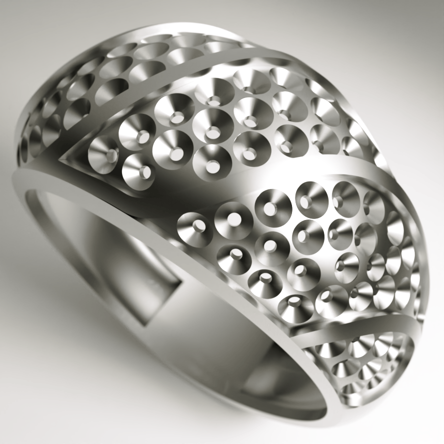
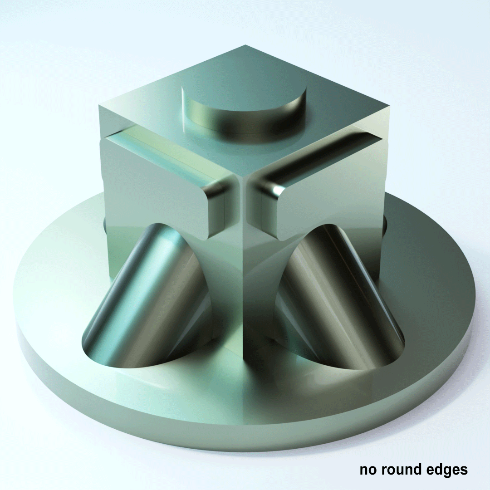

`Python: "map_round_edges"`

The round_edges map is an extremely powerful yet easy way to automatically bevel the hard edges in your geometry. This map analyzes the curvature of contacting faces by proximity, and bends the normals of edges accordingly.

{style="max-width: 80px;"}

{style="max-width: 320px;"}
{style="max-width: 320px;"}

[YouTube video tutorial](https://www.youtube.com/watch?v=YXfCOG1Yyys){:target="_blank"}

## Common

#### Node alias
`Python: "map_alias"`

Human-readable node alias.

#### Alias color
`Python: "map_alias_color"`

Identificative node color.

#### Node UUID
`Python: "map_uuid"`

Node UUID.

#### Node metadata
`Python: "map_metadata"`

User-set node metadata.

#### Node tags
`Python: "map_tags"`

User-set node tags.

## Main

#### Bypass
`Python: "map_bypass"`

When this option is on, the map attributes are dismissed altogether and the input is passed-through to the output.

#### Samples
`Python: "map_round_edges_samples"`

Number of samples used to compute the rounding effect. Higher values produce a more accurate result, but come at a price in performance.

#### Radius
`Python: "map_round_edges_radius"`

Controls the proximity range within the node looks for adjacent faces.

#### Scale
`Python: "map_round_edges_scale"`

This value acts as a radius multiplier.

#### Scale map
`Python: "map_round_edges_scale_map"`

Controls the radius scale multiplier using a grayscale map. This is an excelent way to add irregularities and variation to the round_edges effect.

#### Include in calculations
`Python: "map_round_edges_include"`

Defines whether edges are rounded across different objects sharing the same material or not.

{style="max-width: 320px;"}

