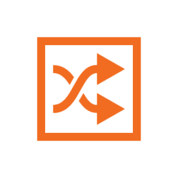

`Python: "map_mix"`

The mix map mixes two colors or maps by the given amount. The amount can be texture-mapped itself.
## Common

#### Node alias
`Python: "map_alias"`

Human-readable node alias.{style="max-width: 32px;"}

#### Alias color
`Python: "map_alias_color"`

Identificative node color.{style="max-width: 32px;"}

#### Node UUID
`Python: "map_uuid"`

Node UUID.{style="max-width: 32px;"}

#### Node metadata
`Python: "map_metadata"`

User-set node metadata.{style="max-width: 32px;"}

#### Node tags
`Python: "map_tags"`

User-set node tags.{style="max-width: 32px;"}

#### Swap colors
`Python: "map_color_swap"`

Swaps the primary and secondary colors.{style="max-width: 32px;"}

#### Primary color
`Python: "map_color_1"`

Defines the primary (background) color. The lower end of the output signal range is remapped to this color.{style="max-width: 32px;"}

#### Primary color map
`Python: "map_color_1_map"`

Defines the primary color using a texture map.{style="max-width: 32px;"}

#### Secondary color
`Python: "map_color_2"`

Defines the secondary (foreground) color. The upper end of the output signal range is remapped to this color.{style="max-width: 32px;"}

#### Secondary color map
`Python: "map_color_2_map"`

Defines the secondary color using a texture map.{style="max-width: 32px;"}

## Main

#### Amount
`Python: "map_mix_amount"`

Amount of blend between both inputs. A value of 0.5 produces a balanced mixture. Values lower than 0.5 make the primary input more prevalent, and vice-versa.{style="max-width: 32px;"}

#### Amount map
`Python: "map_mix_amount_map"`

Amount of blend between both inputs, controlled by a grayscale texture map.{style="max-width: 32px;"}

