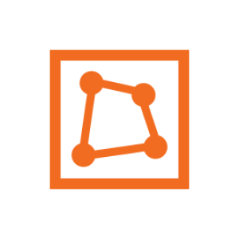

`Python: "map_xform_distortion"`

The xform_distortion map node applies certain non-linear distortions (e.g., noise, jitter blur, ...) to the texture coordinates of the map node(s) it is connected to.
## Common

#### Node alias
`Python: "map_alias"`

Human-readable node alias.{style="max-width: 32px;"}

#### Alias color
`Python: "map_alias_color"`

Identificative node color.{style="max-width: 32px;"}

#### Node UUID
`Python: "map_uuid"`

Node UUID.{style="max-width: 32px;"}

#### Node metadata
`Python: "map_metadata"`

User-set node metadata.{style="max-width: 32px;"}

#### Node tags
`Python: "map_tags"`

User-set node tags.{style="max-width: 32px;"}

## Main

#### Enable UV noise
`Python: "map_distortion_noise_enable"`

Toggles noise distortion in the UVW space on/off.{style="max-width: 32px;"}

#### Noise amount
`Python: "map_distortion_noise"`

Amount of noise distortion applied to the UVs before they are used.{style="max-width: 32px;"}

#### Noise size
`Python: "map_distortion_noise_size"`

Amplitude of the noise distortion. This value is given in UVW space; e.g., 0.1 means that the maximum distortion is about 1/10th of a 1x1x1 texture tile.{style="max-width: 32px;"}

#### Noise octaves
`Python: "map_distortion_noise_octaves"`

Number of times the noise algorithm overlaps onto itself to add high-frequency details.{style="max-width: 32px;"}

#### Noise randomize
`Python: "map_distortion_noise_randomize"`

Random number seed used to randomize the distortion.{style="max-width: 32px;"}

#### Enable jitter blur
`Python: "map_distortion_blur_enable"`

Toggles jitter blur in the UVW space on/off.{style="max-width: 32px;"}

#### Jitter blur radius
`Python: "map_distortion_blur"`

Amount of 2D gaussian (jittering) blur applied to the UVs before they are used. This value is given in UVW space. Note that this type of blur may cause sampling noise that takes long to dissolve. Note also that jitter blur does not produce gamma-correct results, and can't be used for bump or displacement height maps.{style="max-width: 32px;"}

