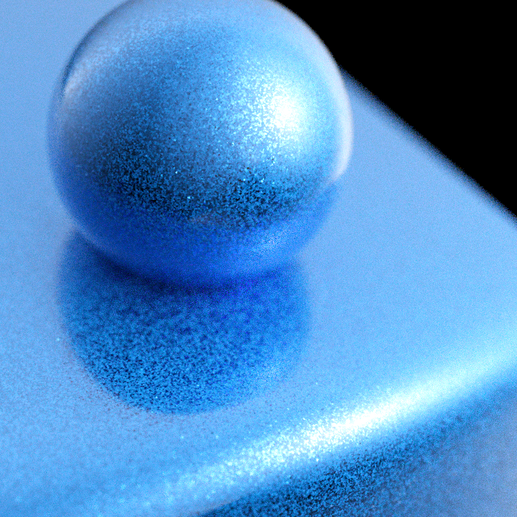

`Python: "map_flakes"`

The flakes map produces a soup of flat tiny shards which can be used to simulate materials such as carpaint. The map issues multiple outputs suitable to control a standard material, all stemming from the same flakes distribution.

{style="max-width: 80px;"}

{style="max-width: 320px;"}

## Common

#### Node alias
`Python: "map_alias"`

Human-readable node alias.

#### Alias color
`Python: "map_alias_color"`

Identificative node color.

#### Swap colors
`Python: "map_color_swap"`

Swaps the primary and secondary colors.

#### Primary color
`Python: "map_color_1"`

Defines the primary (background) color. The lower end of the output signal range is remapped to this color.

#### Primary color map
`Python: "map_color_1_map"`

Defines the primary color using a texture map.

#### Secondary color
`Python: "map_color_2"`

Defines the secondary (foreground) color. The upper end of the output signal range is remapped to this color.

#### Secondary color map
`Python: "map_color_2_map"`

Defines the secondary color using a texture map.

## Main

#### Density
`Python: "map_flakes_density"`

Defines how far apart individual flakes tend to be. Higher values produce a sparse distribution, and lower values produce a dense distribution.

#### Density map
`Python: "map_flakes_density_map"`

Controls the flakes density using a grayscale texture map.

#### Normals randomness
`Python: "map_flakes_normals"`

Defines the overall randomness of flakes in the normals output plug. Lower values tend to align the flakes with the host surface. Higher values allow the flakes to be randomly oriented.

#### Normals randomness map
`Python: "map_flakes_normals_map"`

Controls the randomness of flakes normals using a grayscale texture map.

#### Roughness low
`Python: "map_flakes_roughness_lo"`

Defines the lower limit of the output roughness range. This value affects the roughness output plug, only.

#### Roughness high
`Python: "map_flakes_roughness_hi"`

Defines the upper limit of the output roughness range. This value affects the roughness output plug, only.

#### Randomize
`Python: "map_randomize"`

Random number seed used to randomize the map. Each possible seed produces a distinct version of the map.

## UV transform

#### Crop U (low)
`Python: "map_xform_crop_x_lo"`

Lower limit of the UVW space in the U direction.

#### Crop U (high)
`Python: "map_xform_crop_x_hi"`

Upper limit of the UVW space in the U direction.

#### Crop U direction
`Python: "map_xform_crop_x"`

Shrinks the UVW space to a non-unitary interval along the U direction.

#### Crop V (low)
`Python: "map_xform_crop_y_lo"`

Lower limit of the UVW space in the V direction.

#### Crop V (high)
`Python: "map_xform_crop_y_hi"`

Upper limit of the UVW space in the V direction.

#### Crop V direction
`Python: "map_xform_crop_y"`

Shrinks the UVW space to a non-unitary interval along the V direction.

#### Crop W (low)
`Python: "map_xform_crop_z_lo"`

Lower limit of the UVW space in the W direction.

#### Crop W (high)
`Python: "map_xform_crop_z_hi"`

Upper limit of the UVW space in the W direction.

#### Crop W direction
`Python: "map_xform_crop_z"`

Shrinks the UVW space to a non-unitary interval along the W direction.

#### Master repeat
`Python: "map_xform_repeat"`

Inverse scale the map is generated at. This parameter pre-multiplies the X/Y/Z repeat values. Note that local/world spaces tile at 1mx1mx1m by default.

#### Repeat U
`Python: "map_xform_repeat_x"`

Repeats the map along the X/U axis. Increasing this value increases repetition.

#### Enable U repetition
`Python: "map_xform_tile_x"`

Allows map repetition along the X/U axis. When disallowed, the map becomes zero outside the [0..1] (or cropped) X/U interval.

#### Clamp vs. repeat (U)
`Python: "map_xform_clamp_x"`

Toggles between clamped vs. repeated output outside the [0..1] (or cropped) X/U interval.

#### Repeat V
`Python: "map_xform_repeat_y"`

Repeats the map along the Y/V axis. Increasing this value increases repetition.

#### Enable V repetition
`Python: "map_xform_tile_y"`

Allows map repetition along the Y/V axis. When disallowed, the map becomes zero outside the [0..1] (or cropped) Y/V interval.

#### Clamp vs. repeat (V)
`Python: "map_xform_clamp_y"`

Toggles between clamped vs. repeated output outside the [0..1] (or cropped) X/V interval.

#### Repeat W
`Python: "map_xform_repeat_z"`

Repeats the map along the Z/W axis. Increasing this value increases repetition.

#### Enable W repetition
`Python: "map_xform_tile_z"`

Allows map repetition along the Z/W axis. When disallowed, the map becomes zero outside the [0..1] (or cropped) Z/W interval.

#### Clamp vs. repeat (W)
`Python: "map_xform_clamp_z"`

Toggles between clamped vs. repeated output outside the [0..1] (or cropped) X/W interval.

#### Translate U
`Python: "map_xform_translate_x"`

Offsets the map along the X/U axis.

#### Translate V
`Python: "map_xform_translate_y"`

Offsets the map along the Y/V axis.

#### Translate W
`Python: "map_xform_translate_z"`

Offsets the map along the Z/W axis.

#### Rotate U
`Python: "map_xform_rotate_x"`

Rotates the map about the X/U axis. Positive values rotate the map counter-clockwise.

#### Rotate V
`Python: "map_xform_rotate_y"`

Rotates the map about the Y/V axis. Positive values rotate the map counter-clockwise.

#### Rotate
`Python: "map_xform_rotate_z"`

Rotates the map about the Z/W axis. Positive values rotate the map counter-clockwise.

