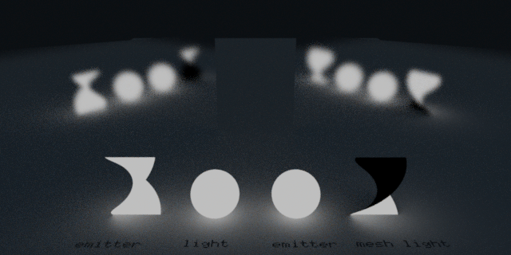
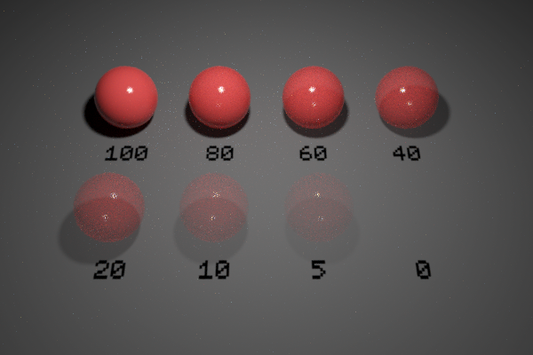

`Python: "mtl_emissive"`

This is a simplified standard material, suitable for matte emissive materials such as lava, embers, ...

!(Icon){style="max-width: 80px;"}

## Common

#### Node alias
`Python: "mtl_alias"`

Human-readable node alias.

#### Alias color
`Python: "mtl_alias_color"`

Identificative node color.

#### Node UUID
`Python: "mtl_uuid"`

Node UUID.

#### Node metadata
`Python: "mtl_metadata"`

User-set node metadata.

#### Node tags
`Python: "mtl_tags"`

User-set node tags.

## UV mapping

#### Projection mode
`Python: "mtl_uvmap_projection"`

Defines the UVW mapping projection mode.

#### Override uvmap
`Python: "mtl_uvmap_override"`

Uses the inner material UVW mapping controls, overriding the uvmap modifier(s) of the host object, if any.

#### Triplanar blend
`Python: "mtl_uvmap_triplanar_blend"`

If the projection is triplanar, defines how much the three planar projections are blended onto each other.

#### Width
`Python: "mtl_uvmap_real_size_x"`

Real world size of the material along the X axis.

#### Height
`Python: "mtl_uvmap_real_size_y"`

Real world size of the material along the Y axis.

#### Depth
`Python: "mtl_uvmap_real_size_z"`

Real world size of the material along the Z axis.

#### Real size link
`Python: "mtl_uvmap_real_size_link"`

Links the three real world dimensions so they are edited together.

#### Width repeat
`Python: "mtl_uvmap_real_size_repeat_x"`

Repeats (i.e., tiles) the UVW mapping along the X axis the given number of times within the defined width.

#### Height repeat
`Python: "mtl_uvmap_real_size_repeat_y"`

Repeats (i.e., tiles) the UVW mapping along the Y axis the given number of times within the defined height.

#### Depth repeat
`Python: "mtl_uvmap_real_size_repeat_z"`

Repeats (i.e., tiles) the UVW mapping along the Z axis the given number of times within the defined depth.

#### Repeat link
`Python: "mtl_uvmap_real_size_repeat_link"`

Links the three real size repeat values so they are edited together.

#### Axis alignment
`Python: "mtl_uvmap_axis_alignment"`

Reorients the projection towards the selected axis.

#### Convert to uvmap modifier
`Python: "mtl_uvmap_convert"`

Creates a uvmap modifier node and transfers the material's UVW mapping attributes. The new uvmap node is applied to the host object.

#### Repeat X
`Python: "mtl_uvmap_xform_repeat_x"`

Repeats the projected UVW space along the X/U axis. Increasing this value increases repetition.

#### Repeat Y
`Python: "mtl_uvmap_xform_repeat_y"`

Repeats the projected UVW space along the Y/V axis. Increasing this value increases repetition.

#### Translate X
`Python: "mtl_uvmap_xform_translate_x"`

Offsets the projected UVW space along the X/U axis.

#### Translate Y
`Python: "mtl_uvmap_xform_translate_y"`

Offsets the projected UVW space along the Y/V axis.

#### Rotate
`Python: "mtl_uvmap_xform_rotate_z"`

Rotates the projected UVW space about the Z/W axis. Positive values rotate counter-clockwise.

## Emission

#### Emission intensity
`Python: "mtl_standard_emission_intensity"`

Controls the intensity of the emission component. Note that standard emission must be preferably used for dim self-illuminating surfaces. For true light sources casting significant light into the scene, light or mesh objects are the correct option.

{style="max-width: 320px;"}

#### Emission intensity map
`Python: "mtl_standard_emission_intensity_map"`

Controls the intensity of the emission component using a texture map.

#### Emission exposure
`Python: "mtl_standard_emission_exposure"`

Exposure (EV) is a logarithmic multiplier. An increment of 1 unit doubles the amount of light emitted and viceversa.

#### Emission color
`Python: "mtl_standard_emission_color"`

Controls the color of the emission component.

#### Emission color map
`Python: "mtl_standard_emission_color_map"`

Controls the color of the emission component using a texture map.

#### Input colorspace
`Python: "mtl_standard_emission_color_inv_gamma"`

Interprets the input emission color/image as regular sRGB (gamma=2.2), as linear (no gamma), or as raw (gamma=1/2.2). e.g., most images are in sRGB, but .hdr/.exr images generally expect to be interpreted as linear. When in doubt, cycle through the options, as one will clearly look good and the other two will look washed out or burned out in direct vision.

## Bump (Normal/Height)

#### Enable bump mapping
`Python: "mtl_normal_enable"`

Enables bump mapping, which can be controlled with a normal map or a height map.

#### Strength
`Python: "mtl_normal_strength"`

Defines the bump strength. A value of 1 in a normal map renders the actual normals as they are represented in the texture. This is particularly relevant for maps that were baked in sculpting software. On the other hand, strength in grayscale height maps is somewhat resolution-dependent and must be adjusted manually.

#### Normal/Height map
`Python: "mtl_normal_map"`

Perturbs the surface normals with a bump (normal or height) map. Bump mapping is universally much cheaper than displacement mapping, and often looks as visually convincing. For extreme relief details, or close ups, displacement may be better suited.

#### Mode
`Python: "mtl_normal_mode"`

Establishes whether the texture must be interpreted as a height map (gray levels) or a normal map (rgb-encoded normals).

#### Height map epsilon
`Python: "mtl_normal_epsilon"`

When a procedural (non-filetex) height map is used, normals are computed on the fly by taking enough map samples to estimate the surface slope on the neighborhood of the pixel being shaded. Bump mapping crispness and proper capture of detail is very sensitive to this value.

#### Invert direction
`Python: "mtl_normal_invert"`

Flips inwards-and-outwards the resulting normals, which is equivalent to negating the strength value. In the case of a height map, this is also equivalent to inverting black-and-white in the input map.

#### Flip X
`Python: "mtl_normal_flip_x"`

Flips the X (U) direction of the input normal map.

#### Swap X/Y
`Python: "mtl_normal_swap_xy"`

Swaps the X/Y (U/V) directions of the input normal map.

#### Flip Y
`Python: "mtl_normal_flip_y"`

Flips the Y (V) direction of the input normal map.

#### Add round_edges
`Python: "mtl_add_round_edges"`

Adds a round_edges map to this material. If the material does not have a bump map yet, a round_edges map is trivially applied. If the material already has a bump map, then this button creates a bump_blend with a round_edges node plugged at its base.

## Displacement (Micro-Patch)

#### Enable displacement
`Python: "mtl_mpdm_enable"`

Enables micro-polygon (micro-patch) displacement mapping (a.k.a., MPDM) in the object the material is applied to. Unlike brute-force subdiv+displacement, MPDM spawns micro-geometry on path-tracing time only, and hence is capable of delivering virtually unlimited amounts of detail with a negligible memory footprint.

#### Displacement height
`Python: "mtl_mpdm_height"`

Determines, in real world units, how high the spawned micro-geometry will be pushed away from the base mesh. This value acts as a multiplier for the height map.

#### Displacement height map
`Python: "mtl_mpdm_height_map"`

Sets the displacement height texture map. Every single texel in the height map will spawn a virtual micro-patch (a bilinear quad patch) in path-tracing time.

#### Midpoint
`Python: "mtl_mpdm_midpoint"`

Defines the displacement baseline. Setting this value to 0.5 will displace half the height inwards and half outwards. The right setting for this value depends on the DCC app used to produce the displacement map. e.g., 32-bit .exr maps exported from ZBrush expect a midpoint value of 0.0.

#### Waterlevel (lo)
`Python: "mtl_mpdm_waterlevel_lo"`

Defines a height map value below which displaced geometry is clipped out. The default value (0) clips no geometry at all.

#### Waterlevel (hi)
`Python: "mtl_mpdm_waterlevel_hi"`

Defines a height map value above which displaced geometry is clipped out. The default value (1) clips no geometry at all.

## Opacity

#### Enable opacity
`Python: "mtl_opacity_enable"`

Enables opacity mapping in the geometry the material is applied to. Note that opacity mapping is computationally-intensive.

#### Opacity
`Python: "mtl_opacity"`

Defines the percentage of light rays that will be allowed to pass through the object not being affected by it in any way.

{style="max-width: 320px;"}

#### Opacity map
`Python: "mtl_opacity_map"`

Defines the opacity level of the object with a grayscale texture map. Opacity maps are interpreted so dark colors make the surface more translucent; i.e., black completely clips the geometry away, whereas white produces fully solid geometry. This map gets multiplied by the numerical opacity value.

#### Single-sided geometry
`Python: "mtl_single_sided"`

When enabled, object(s) this material is applied to will be visible from their front side, but invisible from their back side.

## Trace sets

#### Include list
`Python: "mtl_trace_set_include"`

List of comma or space-separated trace set IDs. If the list starts by - then the list is inverted (i.e., all IDs except for the listed ones). Light paths bouncing at the material will interact with (at least) the objects or lights that belong to the listed trace sets. For example, you can use this list to re-include a trace set that was excluded at a previous GI bounce.

#### Enable include list
`Python: "mtl_trace_set_include_enable"`

Enables or disables the trace sets include list. If enabled, the list is appended to the include list at the object(s) the material is applied to.

#### Exclude list
`Python: "mtl_trace_set_exclude"`

List of comma or space-separated trace set IDs. If the list starts by - then the list is inverted (i.e., all IDs except for the listed ones). Light paths bouncing at the material will not interact with the objects or lights that belong to the listed trace sets. For example, you can use this to make an object exclude the shadows produced by other particular object.

#### Enable exclude list
`Python: "mtl_trace_set_exclude_enable"`

Enables or disables the trace sets exclude list. If enabled, the list is appended to the exclude list at the object(s) the material is applied to.

#### Affect diffuse
`Python: "mtl_trace_set_affect_dif"`

Makes the include/exclude lists be used for bounces at the diffuse component(s) of the material.

#### Affect specular
`Python: "mtl_trace_set_affect_spc"`

Makes the include/exclude lists be used for bounces at the reflective component(s) of the material.

#### Affect transmission
`Python: "mtl_trace_set_affect_trm"`

Makes the include/exclude lists be used for bounces at the refractive component(s) of the material.

#### Include IBL refl/refr overrides
`Python: "mtl_include_ibl_overrides"`

Flags the material in the trace sets system to include the IBL refl/refr overrides regardless of the constraints set in the IBL node.

#### Cull interior geometry
`Python: "mtl_cull_interior"`

When enabled, any geometry intersecting the object(s) this material is applied to will be removed. This is particularly useful to remove geometry that wrongly intersects other objects due to modeling inaccuracies. Metallic prongs intersecting gemstones in jewelry are a classic example.

#### Disable direct lighting
`Python: "mtl_no_direct"`

When enabled the material will not receive any direct lighting.

#### Disable indirect lighting
`Python: "mtl_no_indirect"`

When enabled the material will not receive any indirect lighting.

## Compositing

#### Material ID color
`Python: "mtl_mask_color"`

Choose a custom color for the material ID AOV.

#### Enable material ID color
`Python: "mtl_mask_color_enable"`

Allows to choose a custom color for the material ID AOV. This color is used when the material AOV is set to custom color mode.

#### Render set ID
`Python: "mtl_render_set_id"`

Defines what render set objects using this material will be render in. The list of render sets to be rendered can be enabled and defined in the Render panel.

