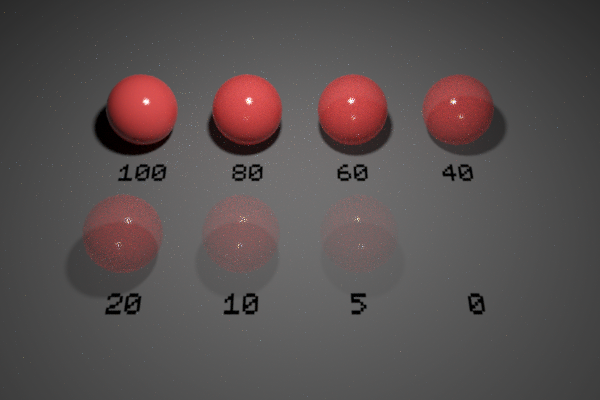

`Python: "mtl_blend"`

With the blend material one can create compound materials. Compound materials can be alloys, where each submaterial contributes a percentage to the total, or mask-based blends where one or more mask maps determine which parts of the object reveal which submaterial.
## Common

#### Node alias
`Python: "mtl_alias"`

Human-readable node alias.{style="max-width: 32px;"}

#### Alias color
`Python: "mtl_alias_color"`

Identificative node color.{style="max-width: 32px;"}

#### Node UUID
`Python: "mtl_uuid"`

Node UUID.{style="max-width: 32px;"}

#### Node metadata
`Python: "mtl_metadata"`

User-set node metadata.{style="max-width: 32px;"}

#### Node tags
`Python: "mtl_tags"`

User-set node tags.{style="max-width: 32px;"}

## UV mapping

#### Projection mode
`Python: "mtl_uvmap_projection"`

Defines the UVW mapping projection mode.{style="max-width: 32px;"}

#### Override uvmap
`Python: "mtl_uvmap_override"`

Uses the inner material UVW mapping controls, overriding the uvmap modifier(s) of the host object, if any.{style="max-width: 32px;"}

#### Triplanar blend
`Python: "mtl_uvmap_triplanar_blend"`

If the projection is triplanar, defines how much the three planar projections are blended onto each other.{style="max-width: 32px;"}

#### Width
`Python: "mtl_uvmap_real_size_x"`

Real world size of the material along the X axis.{style="max-width: 32px;"}

#### Height
`Python: "mtl_uvmap_real_size_y"`

Real world size of the material along the Y axis.{style="max-width: 32px;"}

#### Depth
`Python: "mtl_uvmap_real_size_z"`

Real world size of the material along the Z axis.{style="max-width: 32px;"}

#### Real size link
`Python: "mtl_uvmap_real_size_link"`

Links the three real world dimensions so they are edited together.{style="max-width: 32px;"}

#### Width repeat
`Python: "mtl_uvmap_real_size_repeat_x"`

Repeats (i.e., tiles) the UVW mapping along the X axis the given number of times within the defined width.{style="max-width: 32px;"}

#### Height repeat
`Python: "mtl_uvmap_real_size_repeat_y"`

Repeats (i.e., tiles) the UVW mapping along the Y axis the given number of times within the defined height.{style="max-width: 32px;"}

#### Depth repeat
`Python: "mtl_uvmap_real_size_repeat_z"`

Repeats (i.e., tiles) the UVW mapping along the Z axis the given number of times within the defined depth.{style="max-width: 32px;"}

#### Repeat link
`Python: "mtl_uvmap_real_size_repeat_link"`

Links the three real size repeat values so they are edited together.{style="max-width: 32px;"}

#### Axis alignment
`Python: "mtl_uvmap_axis_alignment"`

Reorients the projection towards the selected axis.{style="max-width: 32px;"}

#### Convert to uvmap modifier
`Python: "mtl_uvmap_convert"`

Creates a uvmap modifier node and transfers the material's UVW mapping attributes. The new uvmap node is applied to the host object.{style="max-width: 32px;"}

#### Repeat X
`Python: "mtl_uvmap_xform_repeat_x"`

Repeats the projected UVW space along the X/U axis. Increasing this value increases repetition.{style="max-width: 32px;"}

#### Repeat Y
`Python: "mtl_uvmap_xform_repeat_y"`

Repeats the projected UVW space along the Y/V axis. Increasing this value increases repetition.{style="max-width: 32px;"}

#### Translate X
`Python: "mtl_uvmap_xform_translate_x"`

Offsets the projected UVW space along the X/U axis.{style="max-width: 32px;"}

#### Translate Y
`Python: "mtl_uvmap_xform_translate_y"`

Offsets the projected UVW space along the Y/V axis.{style="max-width: 32px;"}

#### Rotate
`Python: "mtl_uvmap_xform_rotate_z"`

Rotates the projected UVW space about the Z/W axis. Positive values rotate counter-clockwise.{style="max-width: 32px;"}

## Submaterials

#### Additive
`Python: "mtl_blend_additive"`

Changes the blending mode to Additive.{style="max-width: 32px;"}

#### Material
`Python: "mtl_blend_mtl_1"`

Defines the base material. Blend materials can be nested to extend the maximum number of blended materials.{style="max-width: 32px;"}

#### Material weight
`Python: "mtl_blend_weight_1"`

Blend amount for the base material.{style="max-width: 32px;"}

#### Material weight map
`Python: "mtl_blend_weight_1_map"`

Grayscale texture map which luminance controls the blend amount for the base material.{style="max-width: 32px;"}

#### Material
`Python: "mtl_blend_mtl_2"`

Defines the i-th material layer. Additional layers are stacked on top of the base material.{style="max-width: 32px;"}

#### Material weight
`Python: "mtl_blend_weight_2"`

Blend amount for the i-th material layer.{style="max-width: 32px;"}

#### Material weight map
`Python: "mtl_blend_weight_2_map"`

Grayscale texture map which luminance controls the blend amount for the i-th material layer.{style="max-width: 32px;"}

#### Material
`Python: "mtl_blend_mtl_3"`

Defines the i-th material layer. Additional layers are stacked on top of the base material.{style="max-width: 32px;"}

#### Material weight
`Python: "mtl_blend_weight_3"`

Blend amount for the i-th material layer.{style="max-width: 32px;"}

#### Material weight map
`Python: "mtl_blend_weight_3_map"`

Grayscale texture map which luminance controls the blend amount for the i-th material layer.{style="max-width: 32px;"}

#### Material
`Python: "mtl_blend_mtl_4"`

Defines the i-th material layer. Additional layers are stacked on top of the base material.{style="max-width: 32px;"}

#### Material weight
`Python: "mtl_blend_weight_4"`

Blend amount for the i-th material layer.{style="max-width: 32px;"}

#### Material weight map
`Python: "mtl_blend_weight_4_map"`

Grayscale texture map which luminance controls the blend amount for the i-th material layer.{style="max-width: 32px;"}

## Displacement (Micro-Patch)

#### Enable displacement
`Python: "mtl_mpdm_enable"`

Enables micro-polygon (micro-patch) displacement mapping (a.k.a., MPDM) in the object the material is applied to. Unlike brute-force subdiv+displacement, MPDM spawns micro-geometry on path-tracing time only, and hence is capable of delivering virtually unlimited amounts of detail with a negligible memory footprint.{style="max-width: 32px;"}

#### Displacement height
`Python: "mtl_mpdm_height"`

Determines, in real world units, how high the spawned micro-geometry will be pushed away from the base mesh. This value acts as a multiplier for the height map.{style="max-width: 32px;"}

#### Displacement height map
`Python: "mtl_mpdm_height_map"`

Sets the displacement height texture map. Every single texel in the height map will spawn a virtual micro-patch (a bilinear quad patch) in path-tracing time.{style="max-width: 32px;"}

#### Midpoint
`Python: "mtl_mpdm_midpoint"`

Defines the displacement baseline. Setting this value to 0.5 will displace half the height inwards and half outwards. The right setting for this value depends on the DCC app used to produce the displacement map. e.g., 32-bit .exr maps exported from ZBrush expect a midpoint value of 0.0.{style="max-width: 32px;"}

#### Waterlevel (lo)
`Python: "mtl_mpdm_waterlevel_lo"`

Defines a height map value below which displaced geometry is clipped out. The default value (0) clips no geometry at all.{style="max-width: 32px;"}

#### Waterlevel (hi)
`Python: "mtl_mpdm_waterlevel_hi"`

Defines a height map value above which displaced geometry is clipped out. The default value (1) clips no geometry at all.{style="max-width: 32px;"}

## Opacity

#### Enable opacity
`Python: "mtl_opacity_enable"`

Enables opacity mapping in the geometry the material is applied to. Note that opacity mapping is computationally-intensive.{style="max-width: 32px;"}

#### Opacity
`Python: "mtl_opacity"`

Defines the percentage of light rays that will be allowed to pass through the object not being affected by it in any way.{style="max-width: 32px;"}

{style="max-width: 320px;"}

#### Opacity map
`Python: "mtl_opacity_map"`

Defines the opacity level of the object with a grayscale texture map. Opacity maps are interpreted so dark colors make the surface more translucent; i.e., black completely clips the geometry away, whereas white produces fully solid geometry. This map gets multiplied by the numerical opacity value.{style="max-width: 32px;"}

#### Single-sided geometry
`Python: "mtl_single_sided"`

When enabled, object(s) this material is applied to will be visible from their front side, but invisible from their back side.{style="max-width: 32px;"}

