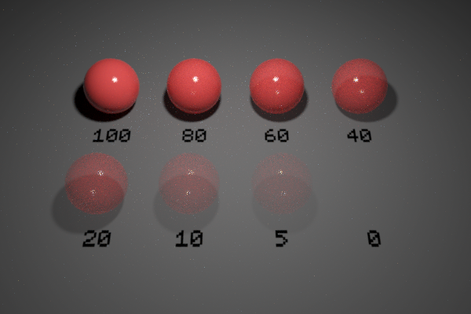

`Python: "mtl_twosided"`

When applied to a surface, this material forks between two other materials. One is used for front side hits, and the other for back side hits. This can be used to control the appearance of both sides in a tree leaf independently, for example. Note that the front and back directions are determined by the surface normals.

!(Icon){style="max-width: 80px;"}

## Common

#### Node alias
`Python: "mtl_alias"`

Human-readable node alias.

#### Alias color
`Python: "mtl_alias_color"`

Identificative node color.

#### Node UUID
`Python: "mtl_uuid"`

Node UUID.

#### Node metadata
`Python: "mtl_metadata"`

User-set node metadata.

#### Node tags
`Python: "mtl_tags"`

User-set node tags.

## Submaterials

#### Front material
`Python: "mtl_twosided_front_mtl"`

Material that will show on the positive (front facing) side of the surface.

#### Swap channels
`Python: "mtl_twosided_swap"`

Swaps the front and back materials.

#### Back material
`Python: "mtl_twosided_back_mtl"`

Material that will show on the negative (back facing) side of the surface.

## Displacement (Micro-Patch)

#### Enable displacement
`Python: "mtl_mpdm_enable"`

Enables micro-polygon (micro-patch) displacement mapping (a.k.a., MPDM) in the object the material is applied to. Unlike brute-force subdiv+displacement, MPDM spawns micro-geometry on path-tracing time only, and hence is capable of delivering virtually unlimited amounts of detail with a negligible memory footprint.

#### Displacement height
`Python: "mtl_mpdm_height"`

Determines, in real world units, how high the spawned micro-geometry will be pushed away from the base mesh. This value acts as a multiplier for the height map.

#### Displacement height map
`Python: "mtl_mpdm_height_map"`

Sets the displacement height texture map. Every single texel in the height map will spawn a virtual micro-patch (a bilinear quad patch) in path-tracing time.

#### Midpoint
`Python: "mtl_mpdm_midpoint"`

Defines the displacement baseline. Setting this value to 0.5 will displace half the height inwards and half outwards. The right setting for this value depends on the DCC app used to produce the displacement map. e.g., 32-bit .exr maps exported from ZBrush expect a midpoint value of 0.0.

#### Waterlevel (lo)
`Python: "mtl_mpdm_waterlevel_lo"`

Defines a height map value below which displaced geometry is clipped out. The default value (0) clips no geometry at all.

#### Waterlevel (hi)
`Python: "mtl_mpdm_waterlevel_hi"`

Defines a height map value above which displaced geometry is clipped out. The default value (1) clips no geometry at all.

## Opacity

#### Enable opacity
`Python: "mtl_opacity_enable"`

Enables opacity mapping in the geometry the material is applied to. Note that opacity mapping is computationally-intensive.

#### Opacity
`Python: "mtl_opacity"`

Defines the percentage of light rays that will be allowed to pass through the object not being affected by it in any way.

{style="max-width: 320px;"}

#### Opacity map
`Python: "mtl_opacity_map"`

Defines the opacity level of the object with a grayscale texture map. Opacity maps are interpreted so dark colors make the surface more translucent; i.e., black completely clips the geometry away, whereas white produces fully solid geometry. This map gets multiplied by the numerical opacity value.

#### Single-sided geometry
`Python: "mtl_single_sided"`

When enabled, object(s) this material is applied to will be visible from their front side, but invisible from their back side.

