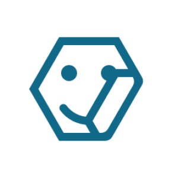

`Python: "mod_sticker"`

A sticker modifier attached to an object clips the given material by the given mask, and projects the result onto the surface of the object. This node is used to place stickers or labels, to create engravings, push buttons, etc... on objects.
## Common

#### Node alias
`Python: "mod_alias"`

Human-readable node alias.{style="max-width: 32px;"}

#### Alias color
`Python: "mod_alias_color"`

Identificative node color.{style="max-width: 32px;"}

#### Node UUID
`Python: "mod_uuid"`

Node UUID.{style="max-width: 32px;"}

#### Node metadata
`Python: "mod_metadata"`

User-set node metadata.{style="max-width: 32px;"}

#### Node tags
`Python: "mod_tags"`

User-set node tags.{style="max-width: 32px;"}

#### Bypass modifier
`Python: "mod_bypass"`

Toggles this modifier on/off.{style="max-width: 32px;"}

#### Show viewport gizmo
`Python: "mod_show_gizmo"`

Shows or hides this node's gizmo in the IPR/views. The gizmo is always visible when the node is selected, regardless of this toggle.{style="max-width: 32px;"}

#### Z-order
`Python: "mod_sticker_zorder"`

This value determines which sticker prevails in areas where two or more stickers overlap. The sticker with the lowest z-order value wins over the rest.{style="max-width: 32px;"}

## UV projection

#### Fit to bitmap
`Python: "mod_sticker_fit_to_bitmap"`

Adjusts the real world size of the sticker to the aspect ratio of the mask image.{style="max-width: 32px;"}

#### Projection
`Python: "mod_sticker_projection"`

Defines the way in which the sticker is projected onto the object(s) it is attached to.{style="max-width: 32px;"}

#### Projection rotation
`Python: "mod_sticker_rotate"`

Rotates the sticker about the direction of projection. i.e., the Z axis in local space.{style="max-width: 32px;"}

#### Width
`Python: "mod_sticker_size_x"`

Real world size of the sticker along the U projection direction.{style="max-width: 32px;"}

#### Height
`Python: "mod_sticker_size_y"`

Real world size of the sticker along the V projection direction.{style="max-width: 32px;"}

#### Link
`Python: "mod_sticker_size_link"`

Links the real world dimensions of the sticker so they are edited together.{style="max-width: 32px;"}

#### Radius
`Python: "mod_sticker_radius"`

Radius of the projection space, when the projection is spherical or cylindrical.{style="max-width: 32px;"}

#### Flip radius
`Python: "mod_sticker_radius_flip"`

Flips the radius of the projection space. This can be used to place stickers in concave (as opposed to convex) surfaces.{style="max-width: 32px;"}

#### Depth
`Python: "mod_sticker_depth"`

Defines how far into the object the projection space reaches. If the projection gizmo perfectly adapts to the object, the depth value can be near 0. If not, a higher depth value may be needed.{style="max-width: 32px;"}

#### Flip depth
`Python: "mod_sticker_depth_flip"`

Flips the projection direction. When disabled, the sticker will be projected inwards the projection gizmo. When enabled, the sticker will be projected outwards the projection gizmo. This option can be used to place stickers in the interior side of an object.{style="max-width: 32px;"}

## Mask

#### Set mask as bump
`Python: "mod_sticker_add_mask_bump"`

Connects the mask map to the bump slot in the sticker material. e.g., to conveniently simulate the thickness of a bumper sticker.{style="max-width: 32px;"}

#### Remove mask from bump
`Python: "mod_sticker_del_mask_bump"`

Disconnects the mask map from the bump slot in the sticker material.{style="max-width: 32px;"}

#### Mask map
`Python: "mod_sticker_mask_map"`

Shape the material will be clipped with. If no map is defined, a stock shape, such as a rounded square, will be used instead.{style="max-width: 32px;"}

## Material

#### Material
`Python: "mod_sticker_mtl"`

Material the sticker is made of.{style="max-width: 32px;"}

#### Take base from sticker mtl
`Python: "mod_sticker_swap_base"`

Replaces all material components (except for diffuse, roughness, and bump) of the underlying object material by the components of the sticker material.{style="max-width: 32px;"}

#### Take diffuse from sticker mtl
`Python: "mod_sticker_swap_diffuse"`

Replaces the diffuse color/map component of the underlying object material by the diffuse color/map component of the sticker material.{style="max-width: 32px;"}

#### Take roughness from sticker mtl
`Python: "mod_sticker_swap_roughness"`

Replaces the roughness value/map component of the underlying object material by the roughness value/map component of the sticker material.{style="max-width: 32px;"}

#### Take bump from sticker mtl
`Python: "mod_sticker_swap_bump"`

Replaces the bump mapping component of the underlying object material by the bump mapping component of the sticker material.{style="max-width: 32px;"}

#### Blend bump with object mtl
`Python: "mod_sticker_blend_bump"`

Blends the bump mapping component of the sticker material with that of the underlying object material.{style="max-width: 32px;"}

