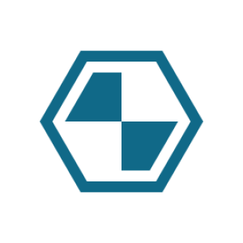

`Python: "mod_uvmap"`

The uvmap modifier overrides the texture coordinates (UVs) of the object(s) it is connected to. The override is made by projecting the geometry of the object(s) onto a shape, such as a plane, a sphere, etc... Note that materials provide their own built-in UVW mapping system, which is enough for most uses. The uvmap node, however, provides some extended functionality, such as interactive positioning in the IPR.
## Common

#### Node alias
`Python: "mod_alias"`

Human-readable node alias.{style="max-width: 32px;"}

#### Alias color
`Python: "mod_alias_color"`

Identificative node color.{style="max-width: 32px;"}

#### Node UUID
`Python: "mod_uuid"`

Node UUID.{style="max-width: 32px;"}

#### Node metadata
`Python: "mod_metadata"`

User-set node metadata.{style="max-width: 32px;"}

#### Node tags
`Python: "mod_tags"`

User-set node tags.{style="max-width: 32px;"}

#### Bypass modifier
`Python: "mod_bypass"`

Toggles this modifier on/off.{style="max-width: 32px;"}

#### Show viewport gizmo
`Python: "mod_show_gizmo"`

Shows or hides this node's gizmo in the IPR/views. The gizmo is always visible when the node is selected, regardless of this toggle.{style="max-width: 32px;"}

## UV mapping

#### Align to camera
`Python: "mod_align_to_cam"`

Aligns the xform of the modifier with the current viewport viewpoint.{style="max-width: 32px;"}

#### Fit to owner object(s)
`Python: "mod_fit_to_owner_obj"`

Resizes the modifier to match the dimensions of its owner object(s).{style="max-width: 32px;"}

#### Center at owner object(s)
`Python: "mod_center_at_owner_obj"`

Centers the modifier at the centroid of its owner object(s).{style="max-width: 32px;"}

#### Dock at owner object(s)
`Python: "mod_dock_at_owner_obj"`

Repositions and reorients the modifier to match the frame of reference of its owner object(s).{style="max-width: 32px;"}

#### Explode modifier
`Python: "mod_explode"`

Explodes the modifier so each of the owner object(s) receives its own individual modifier clone.{style="max-width: 32px;"}

#### Copy from other node
`Python: "mod_copy_from"`

Copies the modifier attributes from other node of the same class in the scene.{style="max-width: 32px;"}

#### Projection mode
`Python: "mod_uvmap_projection"`

Defines the UVW mapping projection mode.{style="max-width: 32px;"}

#### Triplanar blend
`Python: "mod_uvmap_triplanar_blend"`

If the projection is triplanar, defines how much the three planar projections are blended onto each other.{style="max-width: 32px;"}

#### Width
`Python: "mod_uvmap_real_size_x"`

Real world size of the uvmap gizmo along the X axis.{style="max-width: 32px;"}

#### Height
`Python: "mod_uvmap_real_size_y"`

Real world size of the uvmap gizmo along the Y axis.{style="max-width: 32px;"}

#### Depth
`Python: "mod_uvmap_real_size_z"`

Real world size of the uvmap gizmo along the Z axis.{style="max-width: 32px;"}

#### Real size link
`Python: "mod_uvmap_real_size_link"`

Links the three real world dimensions so they are edited together.{style="max-width: 32px;"}

#### Width repeat
`Python: "mod_uvmap_real_size_repeat_x"`

Repeats (i.e., tiles) the UVW mapping along the X axis the given number of times within the defined width.{style="max-width: 32px;"}

#### Height repeat
`Python: "mod_uvmap_real_size_repeat_y"`

Repeats (i.e., tiles) the UVW mapping along the Y axis the given number of times within the defined height.{style="max-width: 32px;"}

#### Depth repeat
`Python: "mod_uvmap_real_size_repeat_z"`

Repeats (i.e., tiles) the UVW mapping along the Z axis the given number of times within the defined depth.{style="max-width: 32px;"}

#### Repeat link
`Python: "mod_uvmap_real_size_repeat_link"`

Links the three real size repeat values so they are edited together.{style="max-width: 32px;"}

#### Axis alignment
`Python: "mod_uvmap_axis_alignment"`

Reorients the projection towards the selected axis.{style="max-width: 32px;"}

#### Repeat X
`Python: "mod_uvmap_xform_repeat_x"`

Repeats the projected UVW space along the X/U axis. Increasing this value increases repetition.{style="max-width: 32px;"}

#### Repeat Y
`Python: "mod_uvmap_xform_repeat_y"`

Repeats the projected UVW space along the Y/V axis. Increasing this value increases repetition.{style="max-width: 32px;"}

#### Translate X
`Python: "mod_uvmap_xform_translate_x"`

Offsets the projected UVW space along the X/U axis.{style="max-width: 32px;"}

#### Translate Y
`Python: "mod_uvmap_xform_translate_y"`

Offsets the projected UVW space along the Y/V axis.{style="max-width: 32px;"}

#### Rotate
`Python: "mod_uvmap_xform_rotate_z"`

Rotates the projected UVW space about the Z/W axis. Positive values rotate counter-clockwise.{style="max-width: 32px;"}

