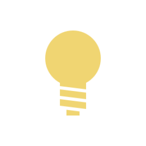

`Python: "obj_light"`

The light object node is the main mechanism to create a light source in Maverick, aside from the environment IBL and the sky/sun.
## Common

#### Node alias
`Python: "obj_alias"`

Human-readable node alias.{style="max-width: 32px;"}

#### Alias color
`Python: "obj_alias_color"`

Identificative node color.{style="max-width: 32px;"}

#### Node UUID
`Python: "obj_uuid"`

Node UUID.{style="max-width: 32px;"}

#### Node metadata
`Python: "obj_metadata"`

User-set node metadata.{style="max-width: 32px;"}

#### Node tags
`Python: "obj_tags"`

User-set node tags.{style="max-width: 32px;"}

#### Primitive
`Python: "obj_light_primitive"`

Selects the geometrical shape of the light between basic math primitives such as planes or discs, or an explicitly given polymesh object.{style="max-width: 32px;"}

#### Mesh light object
`Python: "obj_light_mesh_obj"`

Defines the polymesh object that will act as the shape of the light. This can be used for emitters with complex shapes, such as neon lights. When a mesh light is set up, the emission power of the light source is evenly distributed through the surface of the given polymesh.{style="max-width: 32px;"}

#### Size A
`Python: "obj_light_size_a"`

If the shape is a rectangle, this acts as the width. For disc and sphere shapes this acts as a radius, and Size B is ignored.{style="max-width: 32px;"}

#### Size B
`Python: "obj_light_size_b"`

If the shape is a rectangle, this acts as a height. For cylinder this acts as the axial length, and is ignored for disc or sphere.{style="max-width: 32px;"}

#### Size link
`Python: "obj_light_size_link"`

Links both dimensions so they are edited together.{style="max-width: 32px;"}

#### Trace set ID
`Python: "obj_trace_set_id"`

Trace set this object belongs to. Trace sets can be used to form groups of mutual visibility between cameras, objects, and light sources.{style="max-width: 32px;"}

#### Hide from camera
`Python: "obj_light_hide_from_cam"`

Hides the light from camera, making it effectively invisible, but still casting light.{style="max-width: 32px;"}

#### Transparent
`Python: "obj_light_transparent"`

Makes the light transparent, so other light sources can shine through. Illumination power is not affected in any way.{style="max-width: 32px;"}

#### Normalized
`Python: "obj_light_normalized"`

Normalizes the emission intensity so the amount of light cast remains constant relative to the size of the light. When this option is off, the amount of light cast is proportional to the surface area of the shape.{style="max-width: 32px;"}

#### Affect shadow catcher
`Python: "obj_light_affect_shadow_catcher"`

Determines whether this light illuminates the shadow catcher, or detracts shadows from it instead. Enabling this flag makes the shadow catcher receive light from the light in the same way that a regular material would. For situations where you want to do compositing after rendering and need a neutral background, disabling this flag may be the right option.{style="max-width: 32px;"}

## Emission

#### Enable
`Python: "obj_light_enable"`

Turns the light on/off.{style="max-width: 32px;"}

#### Samples count
`Python: "obj_light_samples"`

Number of samples used for this light, per bounce. When a light is small, distant or occluded, it may produce more noise than other light sources in the scene. Raising the number of samples of the light may detract computation time from other lights, effectively reducing noise.{style="max-width: 32px;"}

#### Light intensity
`Python: "obj_light_intensity"`

Multiplies the emission intensity by the specified value.{style="max-width: 32px;"}

#### Exposure
`Python: "obj_light_exposure"`

Exposure (EV) is a logarithmic multiplier for emission intensity. An increment of 1 unit doubles the amount of light emitted and viceversa.{style="max-width: 32px;"}

#### Kelvin temperature
`Python: "obj_light_kelvin"`

Emission color, defined in the Kelvin temperature scale. Lower values produce a warm (orange-ish) cast while higher values produces a cold (blue-ish) cast.{style="max-width: 32px;"}

#### Enable Kelvin temperature
`Python: "obj_light_kelvin_enable"`

Overrides the emission color with a Kelvin temperature selector.{style="max-width: 32px;"}

#### Emission color
`Python: "obj_light_color"`

Defines the light emission color.{style="max-width: 32px;"}

#### Color map
`Python: "obj_light_color_map"`

Defines the emission color using a texture. 32-bit High Dynamic Range images (.exr, .hdr...) will usually produce correct direct vision appearance and should be preferred.{style="max-width: 32px;"}

#### Input colorspace
`Python: "obj_light_color_inv_gamma"`

Interprets the input emission color/image as regular sRGB (gamma=2.2), as linear (no gamma), or as raw (gamma=1/2.2). e.g., most images are in sRGB, but .hdr/.exr images generally expect to be interpreted as linear. When in doubt, cycle through the options, as one will clearly look good and the other two will look washed out or burned out in direct vision.{style="max-width: 32px;"}

#### LighMixer AOV
`Python: "obj_light_lightmixer"`

Selects which LightMixer AOV the light will be sent to.{style="max-width: 32px;"}

## Spotlight

#### Spotlight type
`Python: "obj_light_spot_type"`

Selects the spot type, between hemispherical (no spot), spotlight (circular cone shape), and spotlight (frustum cone shape).{style="max-width: 32px;"}

#### Spotlight angle
`Python: "obj_light_spot_angle"`

Maximum angle into which the spotlight emits.{style="max-width: 32px;"}

#### Spotlight penumbra angle
`Python: "obj_light_spot_penumbra"`

Interior angle in the spotlight cone away from which the light's intensity starts to decay{style="max-width: 32px;"}

#### Spotlight aspect
`Python: "obj_light_spot_aspect"`

Changes the spotlight aspect ratio by squeezing the spotlight cone in a direction or the other.{style="max-width: 32px;"}

#### Photometric (IES) map
`Python: "obj_light_photometric_map"`

Defines the light spread and intensity based on a photometric (IES) file.{style="max-width: 32px;"}

#### Projector map
`Python: "obj_light_projector_map"`

Sets a texture that will be projected onto the scene, such as in a cinema projector, or as in sun shining through stained glass. The light size must be kept relatively small or the projected texture will look blurry.{style="max-width: 32px;"}

## Compositing

#### Inherit compositing settings
`Python: "obj_inherit_compositing"`

Makes the object inherit the compositing settings from its parent assembly, if there is one. Objects without a parent (and also objects with this flag turned off) use their own compositing settings.{style="max-width: 32px;"}

#### Material ID mask color
`Python: "obj_mask_color"`

Custom mask color for the material ID AOV.{style="max-width: 32px;"}

#### Enable mask color
`Python: "obj_mask_color_enable"`

Enables the custom mask color for the material ID AOV.{style="max-width: 32px;"}

#### Tag object as backdrop
`Python: "obj_render_set_backdrop_enable"`

Flags the object to be treated as a backdrop in the render sets system. Note that for this flag to work, render sets must be enabled in the Render panel.{style="max-width: 32px;"}

#### Render set ID
`Python: "obj_render_set_id"`

Defines what render set this object will be render in. The list of render sets to be rendered can be enabled and defined in the Render panel.{style="max-width: 32px;"}

